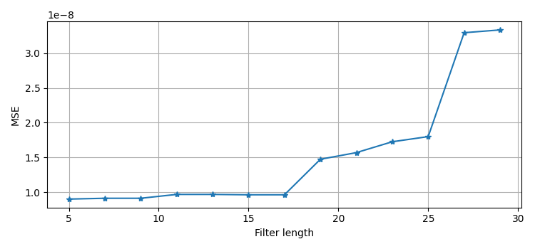
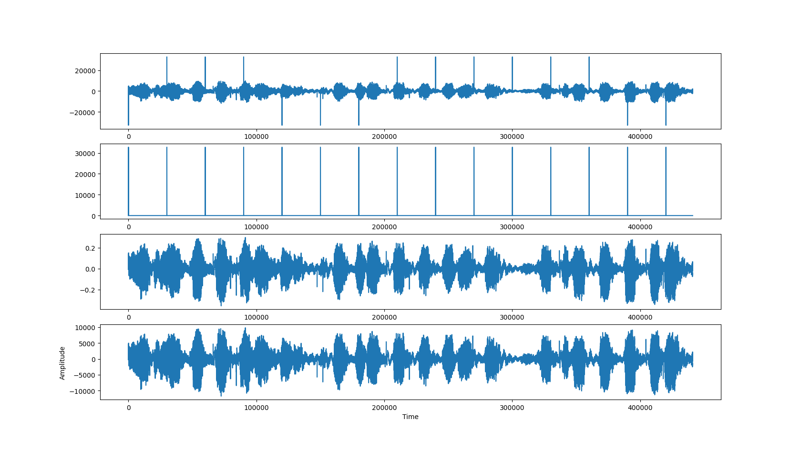

# Audio Restoration Assignment II
Use Median filter and Cubic Spline filter to detect clicks and restore them in audio.


## High-level Description of the project
This assignment builds on Assignment I. We assume that we have successfully detected the clicks and we are applying different interpolation methods to restore the audio, such as
- Median filter:
The median filter is a non-linear digital filtering technique, often used to remove noise from an image or signal.
- Cubic Splines filter:
cubic spline is a piecewise cubic function that interpolates a set of data points and guarantees smoothness at the data points. 


## Installation and Execution
###  Required libraries
- matplotlib==3.6.2
- numpy==1.23.4
- playsound==1.2.2
- scipy==1.9.3
- soundfile==0.11.0
- tqdm==4.64.1
- wavfile==4.5.0


## Files
test.py - include unit test 
eval.py - evaluate the reuslt and calculate the correspond MSE
func_filter.py - include two method for filter

## Usage  

```python
from func_filter import *
medianFilter('degraded_d.wav', 'detectionfile_d.wav', 15, 'output_median.wav')

cubicSplineFilter('degraded_d.wav', 'detectionfile_d.wav', 20, 'output_cubic.wav')
```

## Methodlogy and Results
There are three files are included and the explanations of each of them can be seen at 'Files', the unittesting included in the test.py file.
- Median filter:
- Check the input: check the filter length is ODD and the degrade wav and detection wav have same length.
- Build the filter: select 0.5 as the middle value to determine whether variable i is clicks.
- Save the result and play the audio.

- Cubic Spline filter:
- Check the input: check the degrade wav and detection wav have same length. because we are using the number of knots so do not need to check the ODD number this time.
- Build the filter: use for loop and while loop realize the comparative judgment of index size and number of knots in order to build the CubicSpline(x,y) and turn variable i into the output.
- Save: the result and play the audio.
- Class CubicSpline: usage included three.

**Results**

1. For the Median filter, different lengths were explored to test the effectiveness of the restoration. In particular, the range of 5 to 30 were tested and around 7 was observed to deliver the lowest MSE, as shown in the figure below.



2. Here is the Graph included 'degraded','detection','output_median','output_cubic' From top to bottom:



3. Comparing the two different interpolation methods, we notice that method Cubic Spine achieves a lower MSE. The runtime 2 tests is 0.79s. 

After listening to the two restored files, we notice Both have some more Pronounced clicks, but Cubic Spline's processing result are a little better.


---
## Credits

This code was developed for purely academic purposes by DianZhuang1998 as part of Assignment the EEP55C22 Computational method.